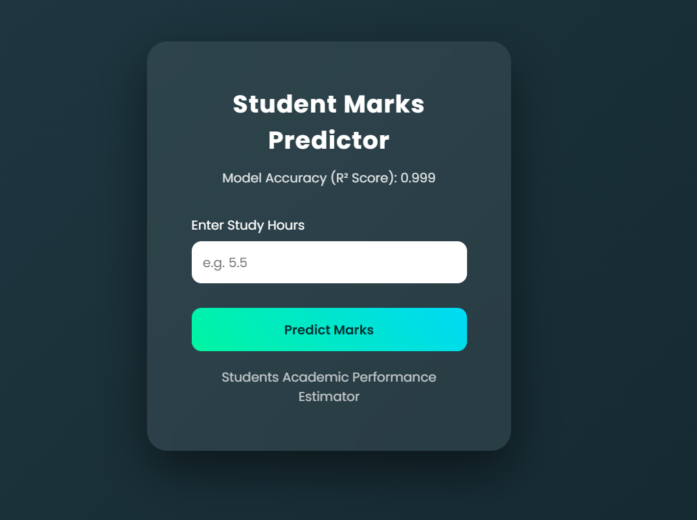
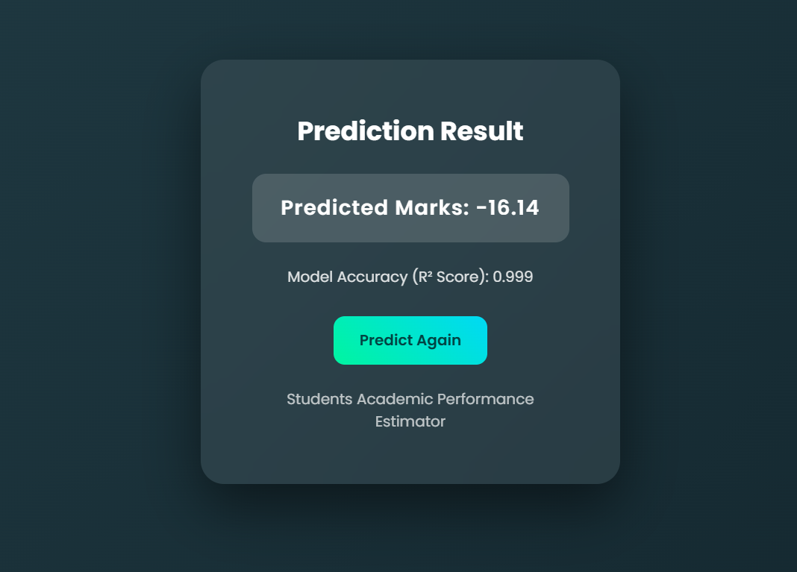

# Student Marks Prediction

## Description
This project predicts students marks based on study hours using machine learning.

## Features
- Data preprocessing
- Model training (Liner Regression)
- Prediction output

## Tech Stack
- Python
- Pandas
- Flask

## How to Run
1. Install requirements: pip install -r requirements.txt
2. Run : python app.py

## Output

## Student Hours

## Student Marks

## Future Improvements
- Improve accuracy
- Add UI
  
